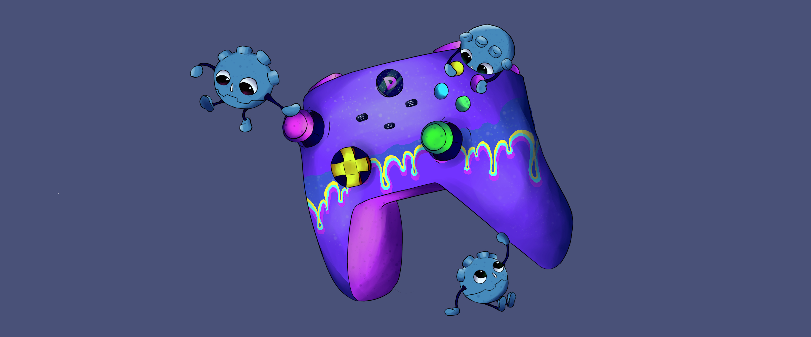

# [Introdução à desenvolvimento de jogos (no motor Godot) ](https://docs.google.com/presentation/d/1GjCFKdS0EDyxbVCh9LJEmndl25cHvfIPeZM7dzR_Bh0/edit?usp=sharing)

Projeto de demonstrações, exemplos e exercícios da Godot 4.4 para a grade "Introdução à Desenvolvimento de Jogos".

## Conteúdo

- 0-6: demonstrações
- desafio_1: exercícios
